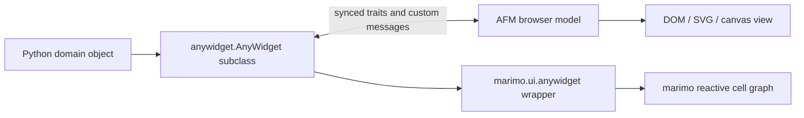
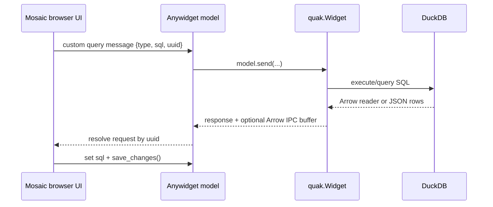
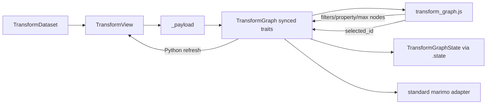

# Anywidget architecture in marimo, quak, drawdata, and marimo_mmp

> **Audience:** maintainers of Python notebook widgets and `marimo_mmp`  
> **Reviewed:** 2026-08-29  
> **Upstream snapshots:** `quak` [`41549f9`](https://github.com/manzt/quak/tree/41549f9253e9de9bd6d7d4fa6b8b7a76630c10b9), `drawdata` [`50cac42`](https://github.com/koaning/drawdata/tree/50cac4265bbb7f37f592b2e7773c24b19ce1e1f3)

## Executive summary

All three projects use the same fundamental split:

1. A Python class subclasses `anywidget.AnyWidget`.
2. `traitlets` tagged with `sync=True` define state shared with the browser.
3. An ECMAScript module implements the Anywidget Front-End Module (AFM)
   lifecycle and renders the browser UI.
4. In marimo, an instance is wrapped in `marimo.ui.anywidget` so changes become
   inputs to marimo's reactive cell graph.

The important answer to the subclassing question is:

| Project | Subclasses `anywidget.AnyWidget`? | Uses `marimo.ui.anywidget` how? |
|---|---:|---|
| `quak` | Yes: `quak.Widget` | **Called**, as `mo.ui.anywidget(quak.Widget(df))`; not subclassed |
| `drawdata` | Yes: `ScatterWidget` and `BarWidget` | **Called** in marimo demos; not subclassed |
| `marimo_mmp` | Yes: `TransformGraph` | **Called** in the notebook as `mo.ui.anywidget(TransformGraph(view))`; not subclassed |

`marimo.ui.anywidget` is a marimo `UIElement` wrapper, not the browser widget
base class. Its documented `.value` is a dictionary of decoded synced traits,
and it proxies other attributes and methods to the wrapped `AnyWidget`. The
three projects accept that generic contract. `marimo_mmp` exposes its typed
`TransformGraphState` through the raw widget's `.state` property, which the
standard marimo wrapper proxies.

The projects differ mainly in where computation lives and what crosses the
Python/browser boundary:

- **quak:** the browser generates SQL; Python runs it lazily in DuckDB. Query
  results travel in custom messages, often as Arrow IPC binary buffers. Only
  the current SQL is durable synced state.
- **drawdata:** the browser owns drawing interactions and synchronizes the
  complete list of points or bins through a `data` trait.
- **marimo_mmp:** Python owns filtering, chemistry, aggregation, and molecule
  depiction. The browser receives a prepared graph and sends back filters and
  selection.

## The two-layer object model

The names are easy to confuse because `marimo.ui.anywidget` is a lowercase
class that is normally called like a factory.



### `anywidget.AnyWidget`: the portable widget

An `AnyWidget` subclass defines:

- `_esm`: JavaScript source, a file/path containing it, or another supported
  ESM specification;
- optionally `_css`: widget CSS;
- `traitlets` tagged with `sync=True` for shared model state;
- optionally custom comm message handlers for traffic that should not be
  durable model state.

This layer can render in any compatible host, including Jupyter, JupyterLab,
VS Code, Colab, and marimo.

### `marimo.ui.anywidget`: the reactive adapter

The [marimo documentation](https://docs.marimo.io/api/inputs/anywidget/) says to
wrap an imported or custom anywidget:

```python
wrapped = mo.ui.anywidget(SomeWidget())
```

The wrapper:

- opens/reuses the widget model and exposes it as a marimo `UIElement`;
- makes widget interaction a dependency that can rerun downstream cells;
- returns all decoded synced traits through `.value` as a dictionary;
- forwards widget-specific attributes and methods, such as
  `drawdata.data_as_polars`, to the underlying object;
- retains the raw instance at `.widget`.

Calling the wrapper is sufficient for normal integration. `marimo_mmp` keeps
that call in its example notebook and does not import marimo in library code.

## quak: queries are the interaction state

### Architectural boundary

[`quak.Widget`](https://github.com/manzt/quak/blob/41549f9253e9de9bd6d7d4fa6b8b7a76630c10b9/src/quak/_widget.py)
subclasses `anywidget.AnyWidget` directly. It accepts dataframe-protocol,
Arrow, Polars, Arrow IPC, or DuckDB inputs and normalizes them into a DuckDB
connection. The input table stays in Python/DuckDB; it is not placed in a
synced trait.

The frontend uses Mosaic clients to express sorting, filtering, histograms,
value counts, paging, and cross-filtering as SQL. This makes the SQL statement
both a reproducible representation of UI state and the public output of the
widget.



### Synced traits and Python API

| Name | Kind | Use |
|---|---|---|
| `_table_name` | Synced `Unicode` | Browser-side SQL source name |
| `_columns` | Synced list of strings | Schema discovery query projection |
| `sql` | Synced `Unicode` | Current query produced by the UI; the durable interaction output |
| `data()` | Python method, not a trait | Executes current `sql` and returns a `DuckDBPyRelation` |

The leading-underscore traits are effectively construction metadata. `sql` is
two-way transport, but the browser is its normal producer and Python consumers
read it. Large or transient results do not become trait state.

### Custom messages and binary data

The browser sends `{type, sql, uuid}` using `model.send`. Python registers
`on_msg`, executes the query, and responds using the same UUID. Arrow results
are serialized as Arrow IPC and returned through the comm's binary `buffers`
channel; JSON and execution acknowledgements use ordinary message fields.

This is the most scalable design in the comparison:

- model state remains small;
- the full source table is not copied into browser state;
- query results are demand-driven;
- Arrow avoids converting tabular results into large JSON trait values;
- request UUIDs allow multiple asynchronous queries to be matched with their
  responses.

### Frontend lifecycle and styling

[`lib/widget.ts`](https://github.com/manzt/quak/blob/41549f9253e9de9bd6d7d4fa6b8b7a76630c10b9/lib/widget.ts)
exports an AFM factory rather than a single `{ render }` object. Its closure
owns one Mosaic `Coordinator` for the widget model.

- `initialize()` installs the query connector and custom-message response
  handling, and returns a cleanup function that clears the coordinator.
- `render()` builds and connects a `DataTable` view.
- SQL signal changes call `model.set("sql", ...)` followed by
  `model.save_changes()`.
- Each `DataTable` attaches its own open shadow root and injects its CSS there,
  preventing selectors from leaking into the notebook.

The model-level lifecycle has cleanup, but the current `render()` does not
return view-level cleanup for the table or its SQL subscription. That is worth
remembering if supporting repeated mounts or several views of one model.

### JavaScript build and distribution

quak has the most formal frontend toolchain:

- TypeScript source lives under `lib/`.
- [`deno.json`](https://github.com/manzt/quak/blob/41549f9253e9de9bd6d7d4fa6b8b7a76630c10b9/deno.json)
  pins/import-maps Mosaic, D3, Flechette, Preact Signals, HTL, UUID, and Temporal
  dependencies.
- The current `deno task build` runs esbuild with `--bundle --minify`, converts
  imported CSS to text, emits ESM, and writes `src/quak/widget.js`.
- `_esm` points to that generated file beside the Python module.
- A Hatch build hook invokes the Deno build when the output does not exist,
  and Hatch includes `src/quak/widget.js` in the Python artifact.

The repository also contains an auxiliary `scripts/build.ts` with CDN-external
and fully bundled modes. The current package build hook calls the fully bundled
`deno task build` path, so published widget execution does not need runtime CDN
imports.

In marimo, quak uses the ordinary adapter:

```python
widget = mo.ui.anywidget(quak.Widget(df))
```

It does not import marimo in its widget package and does not subclass the
marimo wrapper.

## drawdata: synchronized data is the product

### Architectural boundary

[`ScatterWidget` and `BarWidget`](https://github.com/koaning/drawdata/blob/50cac4265bbb7f37f592b2e7773c24b19ce1e1f3/drawdata/__init__.py)
are small `anywidget.AnyWidget` subclasses. JavaScript owns drawing state and
renders SVG through D3. Python receives the generated dataset in a synced list
and provides convenient conversions.

This boundary is appropriate because the widget's product is a modest,
user-created dataset. Unlike quak, there is no large pre-existing table to
query and no need for an RPC protocol.

### Scatter properties

| Name | Kind | Use |
|---|---|---|
| `data` | Synced list | All generated points: `x`, `y`, color, label, and drag batch |
| `brushsize` | Synced integer | Initial/current brush radius; browser changes it |
| `width`, `height` | Synced integers | SVG coordinate system and configured display dimensions |
| `n_classes` | Synced integer | Selects one to four colors/classes; validated at construction |
| `data_as_pandas` | Python property | Builds a pandas DataFrame from `data` |
| `data_as_polars` | Python property | Builds a Polars DataFrame from `data` |
| `data_as_X_y` | Python property | Converts drawn data to NumPy classification/regression arrays |

Points are accumulated locally while the pointer moves. On click or drag end,
the frontend replaces `data` and calls `save_changes()` once. Reset and undo do
the same. Batching at the end of a gesture is a useful decision: it avoids a
Python round trip for every pointer event.

The computed Python properties are not synchronized fields. In marimo they
still appear on the wrapper because `marimo.ui.anywidget` proxies attributes to
the raw widget.

### Bar properties

| Name | Kind | Use |
|---|---|---|
| `data` | Synced list | Flattened collection/bin/value/color records |
| `y_min`, `y_max` | Synced floats | Drawing scale limits |
| `n_bins` | Synced integer | Number of bars per collection |
| `width`, `height` | Synced integers | Fixed SVG dimensions |
| `collection_names` | Synced list | Series names and count |
| `data_as_pandas`, `data_as_polars` | Python properties | Convenience conversions |

The bar frontend synchronizes its full flattened dataset from
`updateDataOut()`, including while a mouse drag updates the chart. This is
simpler than quak's custom protocol, but more chatty than the scatter widget's
end-of-gesture batching.

### JavaScript build and distribution

drawdata keeps readable source in `js/` and compiled artifacts in
`drawdata/static/`:

- source imports a vendored `js/d3.v7.js`;
- esbuild bundles D3 and the widget into a self-contained ESM file;
- the checked-in scatter and bar bundles are roughly 480 KB each uncompressed;
- separate CSS files are assigned to `_css`;
- setuptools package data includes `static/*.js` and `static/*.css` in the
  wheel;
- `_esm` and `_css` use `Path(__file__).parent`, so no CDN is needed at runtime.

The Makefile currently documents the scatter build command only. Both compiled
widget files are checked in, which makes installation simple but means source
and generated artifacts must be kept in sync manually.

### Lifecycle and CSS caveats

The scatter `render()` returns cleanup that removes its container, but its
anonymous `model.on(...)` listeners are not explicitly removed. The bar widget
returns no cleanup. The bar implementation also calls document-wide
`querySelectorAll('button.control')`, so two widget instances can affect one
another.

The scatter CSS mostly uses `dd-`-prefixed selectors, but defines theme tokens
on global `:root`. Bar CSS uses broad selectors including `.controls`,
`.active`, `label`, and `input[type="number"]`. Because anywidget `_css` may be
mounted into a host-wide scope, these selectors can collide with notebook or
other-widget styles. quak's internal shadow root and `marimo_mmp`'s prefixes
are stronger isolation choices.

In marimo, drawdata also calls rather than subclasses the wrapper:

```python
widget = mo.ui.anywidget(ScatterWidget(height=400))
```

## marimo_mmp: typed state on a smart, portable widget

### Architectural boundary

[`TransformGraph`](src/marimo_mmp/widget.py) subclasses
`anywidget.AnyWidget`. Python owns input validation, filtering, aggregation,
RDKit depictions, and lookup back into MMPDB. JavaScript owns the radial SVG
layout, controls, panning, selection, tooltips, and accessibility behavior.

The data flow is:



### Synced traits

| Name | Direction in normal use | Use |
|---|---|---|
| `data` | Python to browser | Graph topology, statistics, control options, counts, and warnings |
| `depictions` | Python to browser | Content-addressed SVG lookup keyed by SHA-256 IDs |
| `selected_id` | Both | Selected product; the browser normally changes it |
| `property_name` | Both | Active property; browser changes trigger Python recomputation |
| `filters` | Both | Evidence/radius/direction/support/effect/text filters |
| `max_nodes` | Both | Bound on visible products |
| `height` | Both | Stage height |

`data` references depictions by digest instead of embedding repeated SVG.
Python retains encountered depictions for one dataset so subsequent filter
responses usually send only dynamic graph JSON. `hold_sync()` groups refreshed
trait assignments, and `_suspend_refresh` prevents redundant recomputation
while several controls are assigned together.

This resembles quak in keeping expensive domain work in Python, but uses
ordinary synced traits rather than custom request/response messages. It
resembles drawdata in using browser controls to write trait state, but avoids
resending the large SVG assets on each interaction.

### Standard marimo wrapper and typed state

The library exports only the raw `TransformGraph`. A marimo notebook constructs
the standard adapter explicitly:

```python
graph = mo.ui.anywidget(TransformGraph(view, height=DEFAULT_GRAPH_HEIGHT))
```

The wrapper's documented `.value` remains the synchronized-trait dictionary.
Its attribute proxy exposes the cohesive domain API as
`graph.state.selected_compound`, `graph.state.rows()`, and
`graph.state.source_pairs()`. `TransformGraph.__deepcopy__` reconstructs the
domain-aware widget without copying comm state, so copying works for raw and
wrapped widgets. The core package has no runtime dependency on marimo.

### JavaScript and CSS distribution

`marimo_mmp` now uses a quak-style source-to-artifact pipeline:

- strict TypeScript and CSS source live under `frontend/`;
- pinned npm dependencies run esbuild with `--bundle --minify` and emit ESM
  plus separate CSS under `src/marimo_mmp/static/`;
- generated assets are ignored by Git, while a Hatch build hook creates them
  when absent and includes them in wheels and source distributions;
- `_esm` and `_css` resolve those package resources with
  `importlib.resources.files`;
- the bundle has no remote imports, so installed widgets work offline and
  under restrictive Content Security Policy settings.

Node is a source-build requirement, not a package runtime dependency. A wheel
built from the sdist reuses the generated assets already carried by the sdist.

The AFM `render({ model, el, signal })` uses the host lifecycle signal for DOM
listeners, registers named model listeners, removes them with `model.off()` on
cleanup, and returns idempotent cleanup. This is more complete per-view
lifecycle handling than the two upstream implementations at the reviewed
commits.

## Decision comparison

| Decision | quak | drawdata | marimo_mmp |
|---|---|---|---|
| Primary product | A reproducible SQL view over large data | A small generated dataset | A filtered chemical transformation graph |
| Python widget base | `AnyWidget` subclass | `AnyWidget` subclasses | `AnyWidget` subclass |
| Marimo integration | Generic wrapper call | Generic wrapper call | Generic wrapper call in notebook |
| Browser framework | TypeScript, Mosaic, D3-related stack, signals | Plain JS + D3 | Plain dependency-free JS |
| Main shared output | `sql` string | Full `data` list | Typed projection of several traits |
| Large-data transport | Custom messages + Arrow IPC buffers | JSON-compatible synced list | Normalized JSON + content-addressed SVG trait |
| Computation owner | DuckDB/Python, orchestrated by browser queries | Browser | Python domain layer |
| Frontend asset strategy | Build/minify/bundle into one ESM artifact | Check in D3 bundles; separate checked-in CSS | Build strict TypeScript into untracked ESM and CSS package artifacts |
| Runtime CDN dependency | No in current package build | No | No |
| CSS isolation | Internal shadow root | Partial prefixes; some global selectors | Prefixed selectors, but no internal shadow root |
| AFM cleanup | Model-level coordinator cleanup | Partial for scatter; none for bar | Host signal + DOM and model cleanup |
| Host portability | High | High | High; library code has no marimo dependency |

## Implications for this repository

The local architecture fits its current problem well. In particular, it should
retain the dependency-free packaged frontend, the normalized depiction store,
end-of-interaction synchronization, and explicit lifecycle cleanup.

Useful lessons from the comparison are:

1. **Keep ordinary traits for durable state.** Selection, filters, property,
   limits, and height should remain traits because Python and browser both need
   their current values.
2. **Use custom messages only for demand-driven bulk results.** If provenance,
   depictions, or future query results become too large or sparse for model
   state, quak's UUID request/response pattern with binary buffers is the model
   to follow. It is not necessary merely to replace the current small control
   traits.
3. **Keep the frontend build reproducible.** The TypeScript migration now
   justifies a quak-style esbuild pipeline. Pin build dependencies, generate
   both assets together, keep installed execution Node-free, and verify wheel
   and sdist contents in CI.
4. **Keep CSS scoped.** The local `mmp-` prefixes avoid drawdata's broad-selector
   problem. An internal shadow root like quak's would provide stronger
   isolation, but it would require deliberate propagation of marimo theme
   tokens and may complicate host integration.
5. **Keep domain state separate from transport state.** `graph.state` gives
   `marimo_mmp` a typed domain API while marimo retains its documented
   trait-dictionary `.value`. Tests should cover both contracts, attribute
   proxying, deepcopy, and access to `.widget` across supported marimo versions.
6. **Do not copy whole-state synchronization blindly.** drawdata's approach is
   ideal for a small drawn dataset; it would be wasteful for repeated molecule
   SVG or large graph updates. The current depiction IDs are the better local
   choice.
7. **Preserve cleanup discipline.** Named `model.on` handlers paired with
   `model.off`, the AFM abort signal, and view-local DOM are important for
   marimo hot reload and multiple displays of one model.

## Sources

- [marimo: Building custom UI elements](https://docs.marimo.io/api/inputs/anywidget/)
- [quak repository snapshot](https://github.com/manzt/quak/tree/41549f9253e9de9bd6d7d4fa6b8b7a76630c10b9)
- [quak Python widget](https://github.com/manzt/quak/blob/41549f9253e9de9bd6d7d4fa6b8b7a76630c10b9/src/quak/_widget.py)
- [quak AFM entry point](https://github.com/manzt/quak/blob/41549f9253e9de9bd6d7d4fa6b8b7a76630c10b9/lib/widget.ts)
- [quak build configuration](https://github.com/manzt/quak/blob/41549f9253e9de9bd6d7d4fa6b8b7a76630c10b9/deno.json)
- [drawdata repository snapshot](https://github.com/koaning/drawdata/tree/50cac4265bbb7f37f592b2e7773c24b19ce1e1f3)
- [drawdata Python widgets](https://github.com/koaning/drawdata/blob/50cac4265bbb7f37f592b2e7773c24b19ce1e1f3/drawdata/__init__.py)
- [drawdata scatter frontend](https://github.com/koaning/drawdata/blob/50cac4265bbb7f37f592b2e7773c24b19ce1e1f3/js/scatter_widget.js)
- [drawdata build and package metadata](https://github.com/koaning/drawdata/blob/50cac4265bbb7f37f592b2e7773c24b19ce1e1f3/pyproject.toml)
- Local implementation: [`widget.py`](src/marimo_mmp/widget.py),
  [`transform_graph.ts`](frontend/transform_graph.ts), and
  [`transform_graph.css`](frontend/transform_graph.css)
- Companion local deep dive: [`WIDGET_ARCHITECTURE.md`](WIDGET_ARCHITECTURE.md)

The external implementation claims in this document come from source
inspection at the pinned commits rather than only from repository READMEs.
