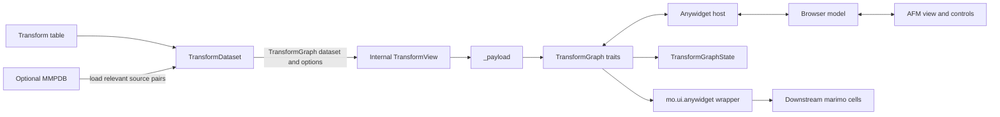

# How the transform graph widget works

> **Content type:** Architecture reference
>
> **Audience:** Package maintainers and notebook authors
>
> **Reviewed:** September 30, 2026
>
> **Scope:** Explain data ownership, synchronization, rendering, resource lifetimes, and verification against the current repository.

`TransformGraph` converts matched-molecular-pair results into an interactive graph. Python validates data, filters records, and generates molecular depictions. An Anywidget Front-End Module (AFM) renders the graph and sends interaction state back to Python. Notebooks use `mo.ui.anywidget()` to make those interactions inputs to marimo’s reactive cell graph; the package itself does not depend on marimo.

This reference describes the implementation in this repository.

## Ownership and source files

The dataset, synchronized widget model, and browser view have different lifetimes. One widget model can have multiple browser views, each with its own DOM, timers, and viewport state.



The implementation is divided across these files:

| File | Responsibility |
|---|---|
| [dataset.py](src/marimo_mmp/dataset.py) | Transform validation, filtering, ranking, and in-memory source-pair provenance |
| [widget.py](src/marimo_mmp/widget.py) | Payload construction, synchronized traits, atomic controls, typed state, and copies |
| [depiction.py](src/marimo_mmp/depiction.py) | Cached RDKit SVG drawing, optional changed-atom matching, and SVG sanitization |
| [transform_graph.ts](frontend/transform_graph.ts) | AFM lifecycle, controls, radial layout, selection, tooltips, and host sizing |
| [transform_graph.css](frontend/transform_graph.css) | Theme tokens, responsive layout, focus states, and reduced motion |
| [transform_explorer.py](notebooks/transform_explorer.py) | Upload handling and reactive graph, provenance, table, and export cells |
| [hatch_build.py](scripts/hatch_build.py) | Build missing frontend assets before packaging |

## Dataset loading and database lifetime

`TransformDataset.from_tsv()` accepts a path, bytes, or a readable stream containing TSV or CSV, optionally gzip-compressed. `from_df()` accepts a pandas DataFrame. Both discover property families and validate product structures, statistics, and optional query SMILES.

An optional MMPDB adds experimental provenance. During loading, the dataset:

1. Opens the database read-only and validates required tables, properties, rule environments, radii, and rule orientation
2. Loads relevant source pairs for every record and property, including structural pairs with missing values
3. Orients compound identifiers, structures, values, and deltas to match each transform
4. Shares pair tuples when records use the same oriented rule environment and property
5. Closes the SQLite connection before returning

The dataset stores those pairs in memory. `source_pairs()` performs no later database reads, so an uploaded temporary database can be deleted immediately after loading. `dataset.mmpdb_path` retains the original path as provenance metadata; it does not guarantee that a file still exists there. The graph’s `hasMmpdb` flag and `state.has_mmpdb` indicate that an MMPDB was loaded; a particular selection can still have no source pairs.

By default, `source_pairs()` omits pairs missing either compound’s selected-property value. `include_missing=True` returns all stored structural pairs. The dataset, `TransformView`, and `TransformGraphState` expose this behavior at their respective record or selection boundaries.

The explorer writes uploaded bytes into a temporary `.mmpdb` file inside an `ExitStack`, loads the dataset, and removes the directory on exit. Cleanup also runs if loading fails. Eager provenance loading increases initial work and memory use with the number of relevant pairs, rather than the size of the entire database.

## Python model and public state

`TransformGraph` accepts a `TransformDataset` with optional `property_name`, `filters`, `max_nodes`, and `direction` arguments. It prepares a `TransformView` internally, builds a browser-safe payload, and initializes ten synchronized traits. The same direction controls both initial filtering and gain/loss coloring. `update(dataset, ...)` validates new options before replacing the current dataset, retains a still-visible selection, and preserves direction unless explicitly supplied. Omitted property, filters, and product limit use the constructor defaults. `dataset.view(...)` remains available for data-only queries.

### Payload and graph levels

`_payload()` returns two dictionaries: dynamic graph data and sanitized SVG assets keyed by content IDs. Python domain objects stay in Python.

The graph has four levels:

| Level | Identifier | Meaning |
|---|---|---|
| Query | One center node | Original compound, or a placeholder when absent |
| Source fragment | `from:{from_smiles}` | Visible rules sharing a source fragment |
| Rule environment | `rule:{environment_id}:{from}>{to}` | Directed transformation in one MMP environment |
| Product | Record ID | Transformed molecule linked to a rule environment |

`data` contains topology, property and filter options, statistics, evidence tiers, warnings, and depiction IDs. Its `shown` count is the number of products included in the payload; `matching` is the number matching filters before `max_nodes` truncation. Source-fragment aggregates describe only rules and products included in the payload.

`depictions` stores SVG strings under `sha256:` IDs. Identical SVG content occupies one dictionary entry. The browser resolves IDs when rendering and displays placeholders and a warning if an asset is missing.

### Synchronized traits and constructor settings

Traits tagged with `sync=True` form the transport contract. Direction describes intended ownership; the public control traits also support direct Python assignment.

| Trait | Direction | Purpose |
|---|---|---|
| `data` | Python to browser | Topology, statistics, options, counts, and depiction IDs |
| `depictions` | Python to browser | Cumulative SVG lookup for the current dataset |
| `selected_id` | Both | Selected product ID |
| `property_name` | Both | Active property family |
| `direction` | Both | Whether higher or lower property deltas are favorable |
| `filters` | Both | Direction, effect, support, radius, evidence, text, and optional statistical limits |
| `max_nodes` | Both | Product limit after filtering and ranking |
| `height` | Both | Requested stage height in pixels |
| `_control_request` | Browser to Python | Complete revisioned control gesture |
| `_control_response` | Python to browser | Accepted or rejected revision and error status |

`highlight_changes` is a constructor-only Boolean, defaulting to `False`. It is available as a read-only Python property and is not synchronized to the browser. `update()` and raw or marimo-wrapped deep copies preserve it. The default height is 1,220 px; the height trait rejects values below 480 px.

### Refresh and selection

Python observes changes to `property_name`, `direction`, `filters`, and `max_nodes` and rebuilds the view. `_suspend_refresh` prevents redundant observer calls when construction, `update()`, or an accepted browser request changes several controls together.

`_refresh()` preserves the selected product if it remains visible. Otherwise, it selects the first visible record, or `None` for an empty view. Filtering retains previously encountered depictions and adds new ones. `update(dataset, ...)` resets the depiction dictionary when the dataset object changes, then publishes the new assets and data together.

Direct Python assignments can trigger separate refreshes. Browser gestures use the atomic request/response path described below. Selection-only changes update `selected_id` without rebuilding the graph payload.

### Typed state and copying

`graph.state` returns an immutable `TransformGraphState` snapshot derived from synchronized traits. It resolves payload product IDs to typed records and exposes selection, property statistics, filters, counts, warnings, rows, and in-memory source pairs. `records` follows payload order; radial positions are a separate browser calculation.

Record property mappings copy their constructor input and expose it read-only. Deep copies rebuild these mappings so dataset and widget copies preserve immutability.

Raw widget copies clone the dataset and construct a new widget with independent transport state. They preserve public state and the highlighting setting while resetting control revisions and the private handshake. The marimo wrapper’s deep-copy path uses this widget implementation.

## Depictions and rendering cost

SVG drawing has a Python cache and a separate synchronized asset store. They solve different problems: the cache avoids repeated computation, while the asset store avoids repeated SVG transfer during filtering.

`molecule_svg()` uses an LRU cache with 2,048 entries keyed by product SMILES, reference SMILES, width, and height. It parses a molecule, computes 2D coordinates, draws an RDKit SVG, and strips active content and external references before returning it.

Changed-atom highlights require a reference structure and `highlight_changes=True`. For each uncached product depiction, `_changed_atoms()` runs an RDKit maximum-common-substructure search against the query, with a one-second timeout per search. The searches run sequentially. A canceled search or absent common structure highlights every product atom. [RDKit’s MCS documentation](https://www.rdkit.org/docs/GettingStartedInPython.html#findmcs) describes the search and timeout behavior.

Enable highlights explicitly when you need them:

```python
raw_graph = TransformGraph(dataset, highlight_changes=True)
```

With highlighting off, the query structure remains visible and product drawing skips MCS matching. Changing query SMILES, clearing or evicting cache entries, reloading the depiction module, or restarting the kernel can require fresh depictions.

During a local live-notebook investigation on September 30, 2026, an uncached highlighted build for 94 bundled products took 27.12 seconds. Changed-atom matching accounted for 26.98 seconds; a warm graph build took 3.4 ms. After making highlights optional, an uncached default graph-cell rerun took approximately 102 ms. These are single local observations, not latency guarantees, and exclude browser paint.

After loading the example dataset below, compare cold and warm constructor times in a Python session. This clears the depiction cache deliberately and measures Python construction, not notebook reruns or browser rendering:

```python
from time import perf_counter
from marimo_mmp.depiction import molecule_svg

for highlight in (False, True):
    molecule_svg.cache_clear()
    for run in ("cold", "warm"):
        start = perf_counter()
        graph = TransformGraph(
            dataset, max_nodes=100, highlight_changes=highlight
        )
        print(highlight, run, perf_counter() - start)
```

### Payload-size baseline

The following measurements use the bundled `bilastine_transforms.tsv`, bilastine query SMILES, default filters, and `highlight_changes=False`. They were recorded on September 30, 2026 with Python 3.11.15, RDKit 2026.3.5, anywidget 0.11.0, and marimo 0.24.0.

Sizes are UTF-8 bytes from compact JSON. The combined column sums only `data` and `depictions`, before transport framing and other traits.

| Requested products | Visible products | `data` bytes | `depictions` bytes | Combined bytes |
|---:|---:|---:|---:|---:|
| 5 | 5 | 4,818 | 127,123 | 131,941 |
| 25 | 25 | 19,387 | 547,335 | 566,722 |
| 100 | 94 | 71,589 | 1,996,232 | 2,067,821 |

Reproduce the size calculation from the repository root in a Python session:

```python
import json
from marimo_mmp import TransformDataset, TransformGraph

dataset = TransformDataset.from_tsv(
    "data/processed/bilastine_transforms.tsv",
    original_smiles=(
        "CCOCCn1c(C2CCN(CCc3ccc(C(C)(C)C(=O)O)cc3)CC2)nc2ccccc21"
    ),
)
for limit in (5, 25, 100):
    graph = TransformGraph(dataset, max_nodes=limit)
    sizes = [
        len(json.dumps(value, separators=(",", ":")).encode("utf-8"))
        for value in (graph.data, graph.depictions)
    ]
    print(limit, len(graph.data["products"]), *sizes, sum(sizes))
```

The initial depiction transfer remains large. A filter refresh that reveals no new depictions sends updated dynamic data without reassigning the SVG trait. When new assets are needed, Python reassigns the cumulative `depictions` dictionary; the implementation does not use a custom per-asset message protocol. Long sessions can accumulate assets until the dataset is replaced.

## Browser controls and synchronization

The browser keeps an optimistic control draft so rapid gestures compose against the latest requested state. Each gesture sends one complete `_control_request` and calls `save_changes()` once.

```mermaid
sequenceDiagram
    participant UI as Browser controls
    participant Model as Anywidget model
    participant Python as TransformGraph
    UI->>Model: Set revision and complete control state
    Model->>Python: save_changes()
    Python->>Python: Validate and build one filtered view
    alt Accepted
        Python->>Model: Controls, data, assets, selection, response
        Model->>UI: Coalesced graph render and matching response
    else Rejected
        Python->>Model: Error response; accepted state unchanged
        Model->>UI: Restore accepted controls and show error
    end
```

A request contains `revision`, `property_name`, `direction`, `filters`, and `max_nodes`. Python rejects malformed, stale, or invalid requests without changing accepted public controls. Accepted requests rebuild the payload once and publish related traits in one `hold_sync()` batch. The browser clears `aria-busy` only when the response matches its pending revision.

Search waits 180 ms before sending a request. Range inputs update their numeric labels during input and synchronize on change. Evidence and minimum-support gestures reset one another. Python supports `max_std` and `max_p_value` filters, but the browser does not expose controls for them.

Selection uses a smaller path: `selectProduct()` sets a string `selected_id` and calls `save_changes()`. The browser also handles Python-originated selection changes through `change:selected_id`.

## Browser view lifecycle and layout

The frontend exports `default { render }`. Each `render({ model, el, signal })` call creates one view and returns a cleanup callback, following the [AFM lifecycle contract](https://anywidget.dev/en/afm/).

### Mounting and cleanup

A view forwards the optional host signal into its own `AbortController`, builds its DOM inside `el`, attaches controls and panning, and registers ten named model listeners. Data and depiction events schedule one graph render through a microtask; selection and height events update their respective view state.

The ten listeners cover `data`, `depictions`, `selected_id`, `filters`, `property_name`, `direction`, `max_nodes`, `_control_request`, `_control_response`, and `height`. DOM listeners use the view’s abort signal; model listeners are removed explicitly with `model.off()`.

Both host abort and the returned callback invoke idempotent cleanup. Cleanup unregisters model and host-signal callbacks, clears timers, cancels animation frames, removes view DOM and its marker class, and releases the host sizing override. A queued graph render checks the cleanup flag before running. Multiple views share model state while retaining independent DOM and view-local state.

### Radial layout and responsive shell

`renderGraph()` positions source fragments on inner rings, rules on middle rings, and products on outer rings. It sorts rules by source group, environment ID, and target fragment, then positions products by rule and product ID. Fixed node footprints and gaps determine ring capacity. The canvas expands beyond its 1,100 px minimum when required and preserves the relative viewport center as its size changes.

The control sidebar starts collapsed. Its toggle state remains browser-local and survives graph renders. At container widths of at least 900 px, the toolbar sits beside the stage; narrower containers stack them. The requested stage height is capped to the viewport with a 480 px floor. The stage supports scrollbars, mouse or pen drag panning, and native touch scrolling.

### Visual encoding, tooltips, and keyboard behavior

Connections encode favorable or unfavorable changes relative to `direction`: green means gain and red means loss, with the mapping reversed for `lower`. The color helper treats effects within ±0.00001 as neutral. Source-fragment gain/loss counts also use the selected direction, but apply no tolerance around zero. Product-edge width increases with support, and dash patterns distinguish evidence tiers. Source-fragment arcs summarize visible gain, loss, and neutral rules.

One tooltip serves query, fragment, rule, and product nodes. It sits outside the scrolling stage, clamps its position to the visual viewport, and uses a compact layout when available width is below roughly 520 px. Keyboard focus supplies node bounds when there is no pointer event.

Product nodes use `role="button"` with `aria-pressed` reflecting the selected product. They form one roving-tabindex group: exactly one product holds `tabindex="0"` (the previously roving product if it still exists after a render, else the selected product, else the first), so the graph is a single Tab stop. Arrow keys move clockwise (Right/Down) or counter-clockwise (Left/Up) in on-screen order, derived from the layout angles starting at 12 o'clock, and wrap; Home and End jump to the first and last product. Enter and Space select a product; Escape dismisses the tooltip. Query, fragment, and rule nodes are informational: `role="img"` with a full `aria-label`, not focusable, with tooltips on pointer hover only. The status region uses `aria-live="polite"`, and CSS respects reduced-motion preferences. Depictions sit on a light backing and product plates turn light under `.dark`, `[data-theme="dark"]`, or `prefers-color-scheme: dark`. Remaining accessibility gaps and test coverage are listed below.

## marimo integration and host sizing

The library remains independent of marimo. Notebook authors wrap the raw anywidget only when downstream cells should react to interaction, using the [marimo anywidget wrapper](https://docs.marimo.io/api/inputs/anywidget/).

Construct and display the UI element in one cell:

```python
import marimo as mo
from marimo_mmp import TransformGraph

graph = mo.ui.anywidget(TransformGraph(dataset, max_nodes=100))
graph
```

Read its domain state in a separate cell:

```python
graph_state = graph.state
selected = graph_state.selected_compound
rows = graph_state.rows()
pairs = graph_state.source_pairs()
```

`graph.state` proxies the typed Python snapshot. `graph.value` is marimo’s dictionary of synchronized traits, and `graph.widget` exposes the raw `TransformGraph`. The wrapper also proxies widget attributes and methods, including `update()` and `highlight_changes`. A consuming cell depends on `graph`; the defining cell does not rerun merely because the UI value changes. See [marimo’s interactive-element rules](https://docs.marimo.io/guides/interactivity/) for the reactive contract.

### Host-specific height override

`releaseMarimoOutputHeightLimit()` reaches outside `el` to find `.marimo-cell.interactive .output-area`, including through a shadow-root host. It temporarily sets `max-height: none` and `overflow: visible` so the graph can use its configured stage height.

A reference-counted map tracks views sharing one output area. The last view restores prior styles if the override values are still present, avoiding overwriting intervening host changes. Outside a matching marimo output area, the function does nothing.

This is a dependency on private marimo DOM classes, not a portable AFM sizing API. Keep it isolated and test it when changing supported marimo versions. The 1,220 px graph default is package configuration; a particular host output cap is not part of this widget’s public contract.

## Frontend assets and packaging

The browser uses bundled local assets without runtime CDN or npm dependencies. `_esm` and `_css` reference package resources through `importlib.resources.files`.

Strict TypeScript and CSS sources live under `frontend/`. `npm run build` invokes esbuild and emits minified `src/marimo_mmp/static/transform_graph.js` and `.css`. These generated files are gitignored but required at runtime and included in wheel and source distributions.

The Hatch hook builds assets only when either file is missing. It does not detect stale existing bundles, so rebuild after frontend edits. A clean source checkout needs `npm ci` before packaging. The distribution verification script checks both archives for required assets.

CSS uses `mmp-` selectors and custom properties to limit collisions in hosts that load styles globally. Host theme variables such as `--background`, `--foreground`, and `--border` have fallbacks. Theme inheritance still needs real-browser verification.

## Verification and remaining limitations

The repository has Python tests and automated AFM DOM tests. It does not yet have a real-browser marimo integration suite.

| Layer | Current coverage | Limits |
|---|---|---|
| [Python tests](tests/test_widget.py) and [dataset tests](tests/test_dataset.py) | Validation, eager provenance after file deletion, multiple properties, direction, payload size, filtering, selection, default-off and opt-in highlights, updates, copies, and packaged assets | Do not exercise browser layout or live host transport |
| [happy-dom tests](tests/js/transform_graph.test.js) with a [model stub](tests/js/model_stub.js) | Depiction lookup, atomic and rapid gestures, evidence/support resets, directional colors, sidebar state, narrow-viewport tooltips, render coalescing, abort cleanup, and multiple views | Simulate the DOM and model; do not verify actual CSS layout, assistive technology, or marimo transport |
| Source guardrails | Local assets, CSS hooks, keyboard-handler and accessibility markers | Presence of code or selectors does not prove behavior |

Run the full verification sequence documented in [AGENTS.md](AGENTS.md). JS tests rebuild the bundle before testing it. For documentation edits, verify local links and executable examples; broad runtime tests are needed when implementation changes.

The remaining implementation and coverage limits are:

- **Sizing:** Replace the [private host override](#host-specific-height-override) when a suitable sizing API exists, or cover it in real marimo integration tests.
- **Accessibility:** Rerendering rebuilds node DOM (roving position and focus are restored by product id), and rule, fragment, and query tooltips are not reachable by keyboard. Preserve the [existing keyboard and live-region behavior](#visual-encoding-tooltips-and-keyboard-behavior).
- **Browser verification:** Keyboard activation and navigation, tooltip placement at every viewport edge, light/dark themes, and actual responsive layout need real-browser coverage.
- **Host integration:** Test downstream cell reactivity, synchronized multiple views, unmount, hot reload, and height restoration in a real marimo page.
- **Performance:** Highlight matching can dominate a cold render. Eager provenance and cumulative SVG assets consume memory; measure both before increasing dataset or graph limits.

## Related references

For upstream contracts and broader design comparisons, use these references:

- [Anywidget architecture comparisons](ANYWIDGET_ARCHITECTURE_COMPARISON.md): dated comparisons with quak and drawdata
- [marimo anywidget API](https://docs.marimo.io/api/inputs/anywidget/): wrapper values and attribute proxying
- [marimo interactive elements](https://docs.marimo.io/guides/interactivity/): cell dependencies and UI values
- [Anywidget Front-End Module specification](https://anywidget.dev/en/afm/): model, rendering, lifecycle, and cleanup contracts
- [RDKit maximum common substructure](https://www.rdkit.org/docs/GettingStartedInPython.html#findmcs): highlight-search behavior
